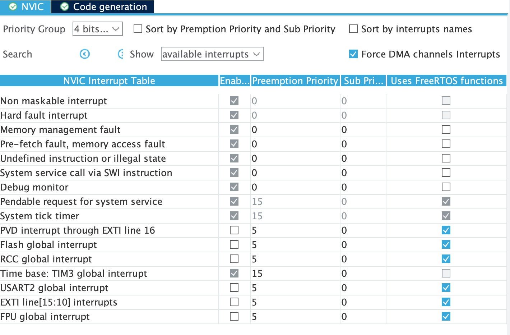
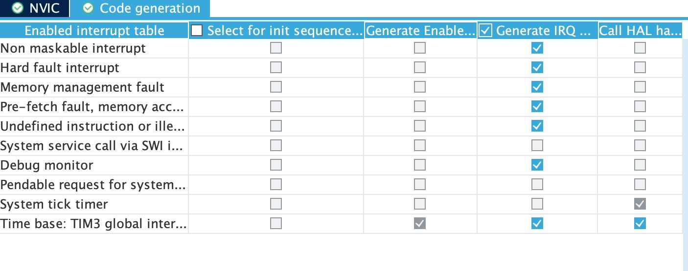
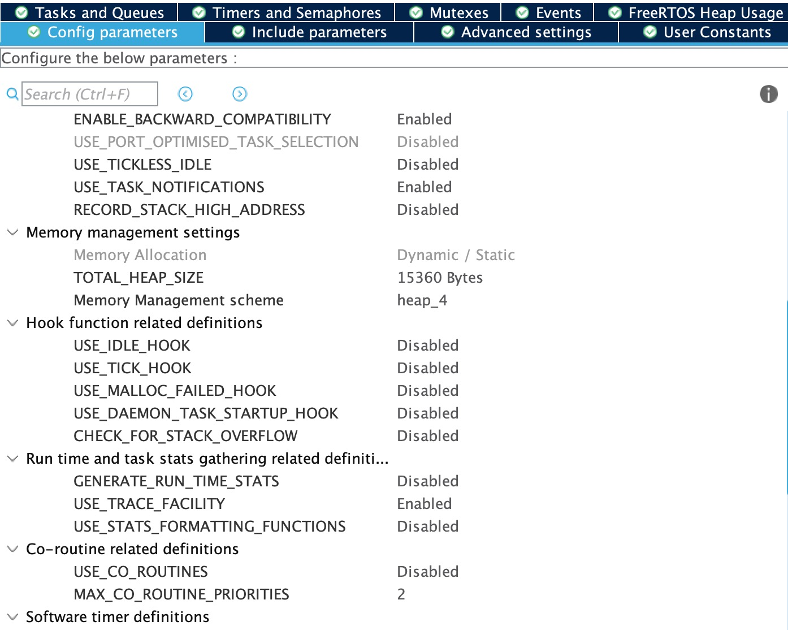

# How to Configure FreeRTOS Using CubeMX (Draft)

In SYS, Choose the Timebase source as TIM7

Add FreeRTOS as Midlware by selecting the Interface "CMSIS_V2"

you can easily enable the FreeRTOS middleware by selecting the wanted CMSIS-RTOS wrapper (V1 or V2) in the Middleware section of the Categories pane

# How to Configure Thread Management

# How to Configure Memory Allocation and Management

## Dynamic Memory Allocation Model

### heap_1.c

### heap_2.c

### heap_3.c

### heap_4.c

### heap_5.c

## Static Memory Allocation Model

# How to Use malloc() and malloc()-dependant newlib Functions With FreeRTOS

## OPTION 1: Not Use Them at All

## OPTION 2: Letting FreeRTOS to Handle the Dynamic Memory Allocation

## OPTION 3: Letting newlib to Handle the Dynamic Memory Allocation

## OPTION 4: Mixing newlib and FreeRTOS to Handle Dynamic Memory Allocation

# Thread-Safety

* Generic strategies:

– Strategy #1: user-defined solution for handling thread safety.

– Strategy #2: allows lock usage from interrupts. This implementation ensures thread safety by disabling all interrupts during, for instance, calls to malloc().
– Strategy #3: denies lock usage from interrupts. This implementation assumes single-thread execution and denies any attempt to take a lock from ISR context. 

* FreeRTOS-based strategies:

– Strategy #4: allows lock usage from interrupts. Implemented using FreeRTOS locks. This implementation ensures thread safety by entering RTOS ISR capable critical sections during, for instance, calls to malloc(). This implies that thread safety is achieved by disabling low-priority interrupts and task switching. High-priority interrupts are however not safe.

– Strategy #5: denies lock usage from interrupts. Implemented using FreeRTOS locks. This implementation ensures thread safety by suspending all tasks during, for instance, calls to malloc().

