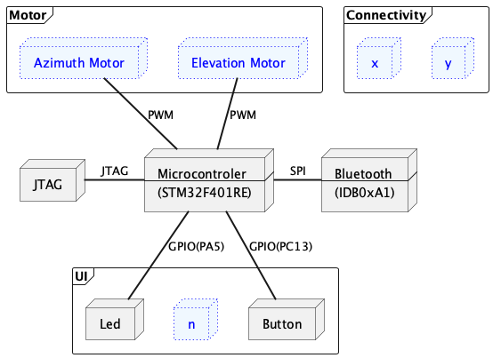
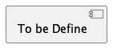

# Purpose & Scope
# Hardware Architecture

# Software System Environment

# System Software Architecture

## 1. Application:

 1.1. Bootloader

 1.2. Upgrader

 1.3. Manufactor

 1.4. Production

 1.5. Electromagnetic Interference/ Electromagnetic Compatibility (EMI/EMC)

 1.6. Application

## 2. Middleware

2.1. RTOS

2.2. OSAL

2.3. Error/Logs

2.4. Bluetooth

2.5. Self-Test

2.6. Security

## 3. Boards

3.1. Drivers

3.1.1. Debug Port (UART)

3.1.2. User Interface(Led, Button)

3.1.3. Bluetooth (SPI)

3.1.4. File System (SDCard)

3.2. Microcontroler

GPIO, UART, SPI, 
 
# Functional Decomposition

# File System Component

# Network Component
 

# USB Component 
- USB (Host Core, Device Core)
- USB Host (MSC, CDC, Custom)
- USB Device (MSC, CDC, Custom)
- Driver (Host, Device)
