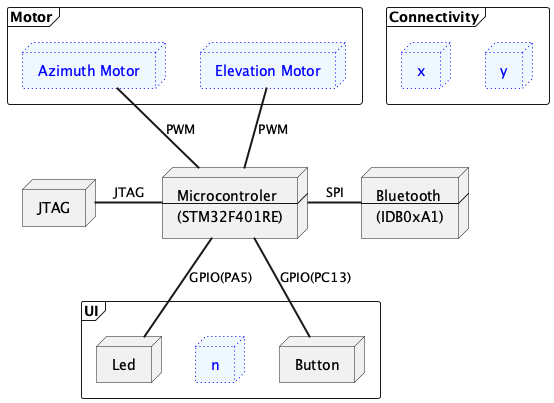
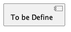

# Purpose & Scope
# Hardware Architecture

# Software System Environment

# System Software Architecture

# Functional Decomposition

# File System Component

# Network Component
 

# USB Component 
- USB (Host Core, Device Core)
- USB Host (MSC, CDC, Custom)
- USB Device (MSC, CDC, Custom)
- Driver (Host, Device)
